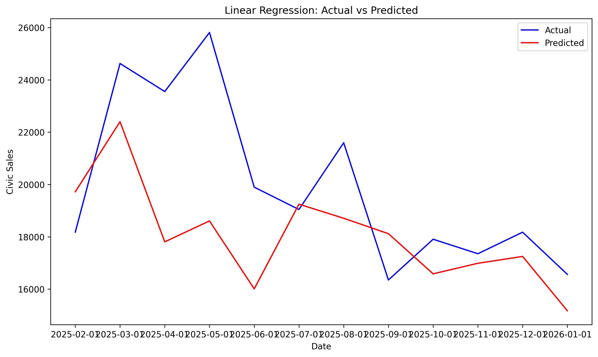

# Predicitng The Total Number of Honda Civic Sales in the United States
Utililzing key metrics and similar car models we aimed to predict the total number of Honda Civics sold in the United States. Our key metrics included the Core CPI, federal funds rate, gas price, unemployment rate, CSI, and the TDSP. While we used the Nisssan Sentra and Toyota Corrola as our comparable car models.

## I. Data
### Data Sources
For our key metrics we utilized the Federal Reserve Bank of St. Louis (FRED) data provided on their website. Links to each specific dataset are provided below: 
Core CPI: https://fred.stlouisfed.org/series/CPILFESL
Federal Funds Rate: https://fred.stlouisfed.org/series/FEDFUNDS
Gas Prices: https://fred.stlouisfed.org/series/GASREGW
Unemployment Rate: https://fred.stlouisfed.org/series/UNRATE
CSI: https://fred.stlouisfed.org/series/UMCSENT
TDSP: https://fred.stlouisfed.org/series/TDSP

For our data on the total unit sales in the United States of the Honda Civic, Nissan Sentra, and Toyota Corrola we utilized the GoodCarBadCar Automotive Sales Data website. Links to each specific dataset are provided below:
Honda Civic: https://www.goodcarbadcar.net/honda-civic-sales-figures/
Nissan Sentra: https://www.goodcarbadcar.net/nissan-sentra-sales-figures/
Toyota Corrolla: https://www.goodcarbadcar.net/total-toyota-corolla-sales-figures-usa-canada/

### Data Collection
Our key metric datasets were downloaded directly in CSV format from their respective FRED webpages. Our car sales data was downloaded from GoodCarBadCar in an excel worksheet format. From the excel format, we exported the file as a CSV for consistenty across our datasets. After we had all our data in a CSV format we ran our data cleaning file (data/data_cleaning.py) to create a combined table (data/combined_table.csv) to utilize for our modeling and analysis.

### Limitations of Data 
1. The TDSP data was measured at a quarterly frequency which is inconsistent with our car sale data which is measured monthly. To account for this, we generalized the TDSP data monthly through a value assumption of consistent TDSP measures across each month of the quarter. A second factor we had to consider was that the last tracking period of the dataset was July 2025. To avoid implicit bias through months beyond July 2025, we ensured our train data consisted of earlier monthly data only to retain validity of our predictions
2. The Nissan Sentra model sales data concluded with December 2025 unlinke the data for the Honda Civic and Toyota Corolla which concluded with January 2026. To create consistency among the car sales data, we forward filled the Sentra data to match the Sentra December 2025 data. Similarly to the TDSP limiation, we ensured our train data did not consistent of this specific data point.
3. We are limited on the total number of observations as the car sales data begins in January 2005. With this limited dataset, it restricts the models capabilities to learn the complex patterns and trends present which can result in the models overfitting to the data. 
4. Economic impacts such as the COVID-19 pandemic, the housing crisis, or the chip shortage can cause greater flucuations over specific time frames in the data that is not explained wihtin our key metrics. 

### Potential Extensions of Data 
1. Investigating the impacts of specific economic events such as the US housing crisis and the Covid-19 Pandemic
2. Utilizing the key metrics to predict the unit monthly sales across different brands and models 

### Glossary 
CPI - The Consumer Price Index
CSI - Consumer Sentiment Index
TDSP - Percent Household Debt of Disposable Income

## II. Model Analysis 
*explanations, evaluations, limitations*
### Linear Regression
The linear regression acted as our baseline model. No adjustemnts to weights, addition of dummy variables, or any other modifications were added to improve performance. The model took the following form, with all variables being included in the regression:

Civic_sales = 𝛼 + β1(corrola_sales) + β2(sentra_sales) + β3(cpi) + β4(fedfunds) + β5(gas) + β6(unemploy) + β7(csi) + β8(tdsp) + ε

The regression itself suffers from multiple issues, all of which likely impact the model's predictive capabilities. As can be seen by running the Linear_Regression.py file and observing the table it produces, the model suffers from both autocorrelation (because we regressed trends) and multicollinearity. This makes it hard to interpret the regression table or draw conclusions from many of the coefficients.

In terms of predictive capabilities, the model produces the following results:
Train MSE: 17646666.70
Test MSE: 10291781.38
Root Train MSE: 4200.79
Root Test MSE: 3208.08
R-squared: 0.67

The first plot shows the overall fit of the linear regression model on the dataset. 

While the model does appear to fit the actual data decently well. During periods of shocks, however, the model fails and often desyncs from the data. This creates points of extreme differences, and as such, hurts the model's prediction abilities as these points of failure compound. 
This becomes far more evident when we zoom into the model's prediction for 2025 sales, as can be seen below:

Visually, the model is far more disjointed than in the overall dataset, especially from March 2025 to October 2025. This is likely a result of the model failing to account for seasonal changes in sales, and as such, the model becomes significantly less accurate. 

Overall, the linear regression acts as a good standard for assessing the performance of the other models, however, it loses its predictive strength in the face of shocks or extreme peaks in sales figures. While adjustments such as adjusting for seasonality may improve its performance, those are out of the scope of this project. 

### LASSO

### Time Series (ARIMA)

### Random Forest 

### Decision Tree

## III. Recomendations 
*best model and approach*

## IV. Rerun Instructions
### Requirements 
Your code will be executed in a Python environment contatining the Standard Library and the packages specified in requirements.txt. Install them with pip install -r requirements.txt.

### Data Collection and Cleaning
The data is uploaded within this repo in the raw_data folder (data/raw_data). The original files themselves can be retrived from the links provided with the Data Sources section of this readme. To clean the data, use our 'data_cleaning.py' which can be found in our data folder. Running the cleaning file will produce 'combined_table.csv' that combines all our datasets and provides clean data ready for modeling and analysis

### Modeling 

